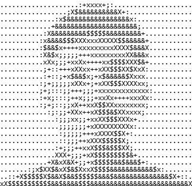

<div align="center">

# Prasad Gite

**Software Engineer building ML systems, algorithmic infrastructure, and data-intensive applications.**

Currently studying **Modern C++**, **Advanced Algorithms**, and **Data Science**, with an evolving focus on **High-Performance Computing**, **Quantitative Computing**, and **ML Systems Engineering**.

<br />



</div>

---

## Selected Engineering Work

### FlowVest

**AI-Powered Financial Management Platform for Small Businesses**

Financial intelligence and forecasting platform designed for real-time cash-flow monitoring, transaction processing, and time-series forecasting.

`React` `Node.js` `MongoDB` `WebSockets` `AWS` `LSTM` `ARIMA`

**Engineering Areas**

- Real-time financial data processing and monitoring.
- WebSocket-driven live updates.
- Time-series forecasting using LSTM and ARIMA models.
- Banking and accounting API integrations.
- Containerized backend services deployed on AWS.

---

### SmartPath

**Dynamic Routing System for Warehouse Optimization**

Real-time warehouse routing system using graph algorithms, event-driven communication, and hardware/software integration.

`MongoDB` `Express.js` `React` `Node.js` `WebSockets` `Dijkstra's Algorithm` `Arduino`

**Engineering Areas**

- Dynamic pathfinding using Dijkstra's algorithm.
- Real-time routing event infrastructure.
- WebSocket-powered monitoring dashboard.
- REST-based Arduino integration.
- Hardware/software communication.

---

### AgroVision

**Thermal Imaging Drone for Crop Health Monitoring**

Computer vision and machine-learning system for UAV-based crop-health monitoring using thermal imagery.

`Python` `OpenCV` `MATLAB` `Machine Learning` `Thermal Imaging`

**Engineering Areas**

- Thermal image processing.
- Computer vision pipelines.
- Predictive crop-health classification.
- Sensor calibration and image acquisition.
- Hardware/software integration.

---

## Engineering Areas

| Domain | Technologies | Engineering Evidence |
|---|---|---|
| **ML Systems** | PyTorch, YOLOv8, TensorRT, ONNX Runtime, CUDA | Production computer-vision pipelines and inference optimization |
| **AI Systems** | RAG, LLMs, LangChain, Vector Databases | Retrieval, document ingestion, embedding, and chatbot systems |
| **Algorithms** | Graph Algorithms, DSA, Dijkstra's Algorithm | SmartPath routing infrastructure |
| **Real-Time Systems** | WebSockets, Node.js, REST APIs | FlowVest and SmartPath |
| **Data Systems** | PostgreSQL, MongoDB, SQL | Application persistence and data processing |
| **Infrastructure** | AWS EC2/S3, Docker, CI/CD, Git | Application deployment and ML infrastructure |

---

## Current Technical Direction

```text
Studying       │ Modern C++ · Advanced Algorithms · Mathematical Foundations for Data Science

Building       │ FlowVest · Engineering Portfolio

Exploring      │ High-Performance Computing · Quantitative Computing · ML Systems

Practicing     │ Algorithmic Problem Solving · Kaggle · Systems Programming
